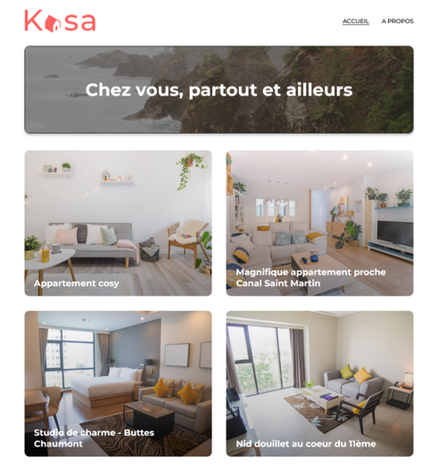
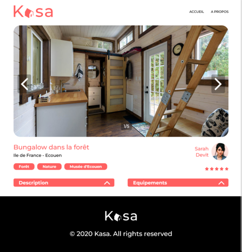

# OpenClassrooms - Kasa

This is my solution for the project n°8 - OpenClassrooms - Web Integrator training : Kasa

## Table of content

-   [overview](#overview)
    -   [The project](#the-project)
    -   [Screenshot](#screenshot)
    -   [Links](#links)
-   [My process](#my-process)
-   [Skills evaluated](#skills-evaluated)

## Oveview

### The project

-   Project : Implement the front-end of an application using React and React Router

-   Context :

    -   Kasa is a private apartment rental compagny
    -   Kasa's website was built with ASP.NET framework 10 years ago and need to be completely revisited.

-   Final goal : Kasa's website completely revisited with an entirely stack in JavaScript. NodeJS for the backend and React for the frontend

### Screenshot

### Links

-   Solution URL: [My github solution here](https://github.com/Amalynn/oc-iw-p8-kasa)

## My process

This project was built with :

-   Mobile-first approach
-   React v.18.2.55
-   React Router v6.22.3
-   NodeJS v.18.14.0
-   npm v.9.5.0
-   Sass v.1.71.1 compiled with dart2js v.3.3.0
-   ViteJS v.5.1.0

## Skills evaluated

-   Configure navigation between application pages with React Router
-   Develop interface elements of a web site using React components
-   Implement CSS animations
-   Develop a web interface with Sass
-   Initialize an app with Create React App / ViteJS
